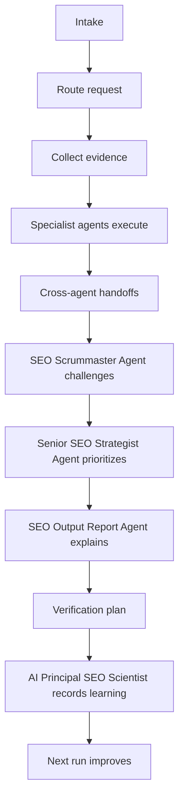

# Agent Synergy Map

This map explains how the SEO agent system works as one operating loop.

The canonical machine-readable contract is `orchestration/agent-synergy-map.json`.

## Operating Loop

## Required Governance Roles

- `SEO Scrummaster Agent`: challenges evidence, conflicts, risk, and completion.
- `Senior SEO Strategist Agent`: prioritizes accepted findings against business goals and capacity.
- `SEO Output Report Agent`: turns findings, completed work, recommendations, risks, and next steps into plain language.
- `AI Principal SEO Scientist`: records rule changes, source updates, deprecations, and reusable learning.

## Handoff Rules

| Condition | Handoff |
| --- | --- |
| Evidence is missing, stale, contradictory, or outside authority | `SEO Scrummaster Agent` |
| Work requires code, redirects, schema, deployment, tests, or rollback | `Senior SEO Engineer Agent` |
| Public website/app copy is created or changed | `SEO Copywriter/Content Agent` using `anti-ai-public-writing` |
| Non-technical reporting is needed | `SEO Output Report Agent` |
| A source update should change future behavior | `AI Principal SEO Scientist` |

## Workflow Ownership

| Workflow | Lead | Final Output Owner |
| --- | --- | --- |
| Full audit | `SEO Full Audit/Analyst Agent` | `SEO Output Report Agent` |
| Technical deployment | `Senior SEO Engineer Agent` | `Senior SEO Engineer Agent` |
| Content production | `SEO Copywriter/Content Agent` | `SEO Copywriter/Content Agent` |
| Monitoring | `SEO Full Audit/Analyst Agent` | `SEO Output Report Agent` |
| Continuous learning | `AI Principal SEO Scientist` | `AI Principal SEO Scientist` |

## Proof Integration

The synergy map connects to `examples/proof-pack/proof-pack-manifest.json`. Every mapped proof unit must remain:

- discoverable
- tested
- explicit about what it proves
- explicit about what it does not prove
- free of live-provider and live-ranking overclaims

## Completion Rule

A workflow is not complete until:

1. the lead agent has produced an evidence-backed output,
2. required supporting agents have contributed or abstained with reason,
3. the Scrummaster challenge has accepted or risk-accepted the result,
4. the final output owner has produced the correct artifact,
5. verification steps are listed,
6. learning updates are recorded when future behavior should change.
