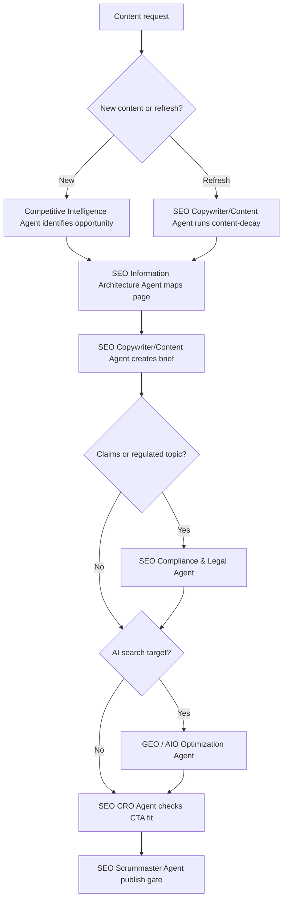

# Content Production Workflow

1. Competitive Intelligence Agent identifies opportunity.
2. SEO Information Architecture Agent maps topic to site structure.
3. SEO Copywriter/Content Agent creates brief.
4. GEO / AIO Optimization Agent adds citable passage requirements.
5. SEO Knowledge Graph Sync Agent validates entity requirements.
6. SEO Compliance & Legal Agent reviews claims and disclosures.
7. SEO Accessibility Agent checks media and structure requirements.
8. SEO CRO Agent aligns CTA with intent.
9. SEO Scrummaster Agent verifies quality gate.
10. SEO Full Audit/Analyst Agent monitors post-publication performance.

## Required Content Quality Gate

- Clear intent
- Unique value
- Evidence or experience
- Accurate claims
- Useful structure
- Internal links
- Metadata
- Schema if applicable
- Accessibility requirements
- Conversion path
- Measurement plan

## Decision Tree

## Failure Handling

- If no unique value can be defined, do not create the page.
- If topic cannibalizes an existing page, refresh or consolidate instead.
- If claims cannot be supported, revise or block publication.
