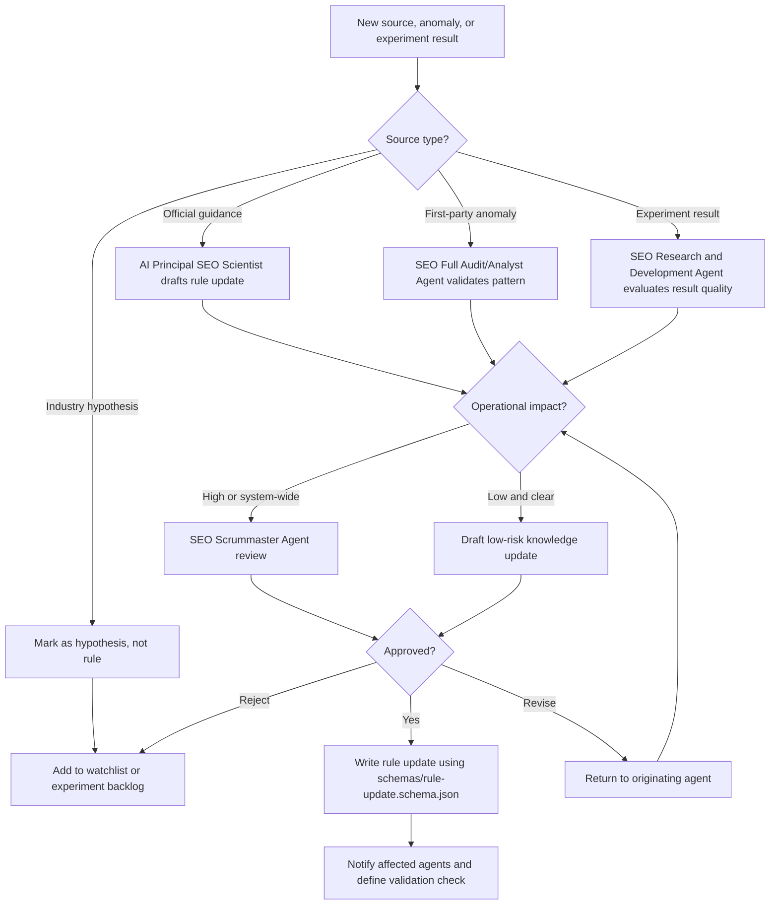

# Continuous Learning Workflow

1. AI Principal SEO Scientist monitors official search, structured data, accessibility, and policy sources.
2. SEO Research and Development Agent tests or validates uncertain tactics.
3. SEO Full Audit/Analyst Agent reports performance anomalies.
4. SEO Scrummaster Agent reviews proposed rule changes.
5. SEO Knowledge Graph Sync Agent updates entity and source-of-truth data where relevant.
6. Accepted updates are written using `schemas/rule-update.schema.json`.
7. Agents adopt new rule only after versioned approval.

## Decision Tree

## Source Confidence

High:

- Official documentation
- First-party data
- Controlled internal experiment with adequate evidence

Medium:

- Repeated field observations
- Multiple independent credible tests

Low:

- Industry commentary
- Anecdotal reports
- One-off examples
