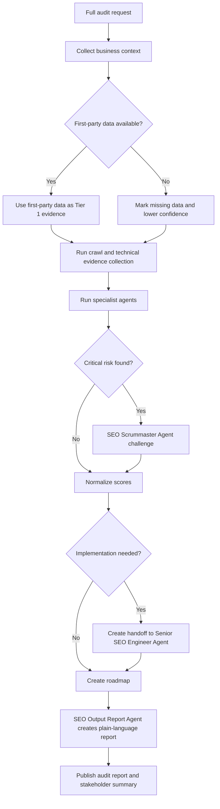

# Full Audit Workflow

1. Define target domain, business model, market, competitors, and goals.
2. SEO Diagnostic Infrastructure Agent checks whether the diagnostic stack and data access are sufficient.
3. Gather first-party data if available.
4. Crawl site and collect technical evidence.
5. Run SEO Technical Agent.
6. Run SEO Copywriter/Content Agent.
7. Run SEO Information Architecture Agent.
8. Run SEO Accessibility Agent.
9. Run SEO CRO Agent.
10. Run GEO / AIO Optimization Agent.
11. Run Local SEO Agent or International & Multilingual SEO Agent when applicable.
12. Run Negative SEO & Security Agent.
13. Run Competitive Intelligence Agent.
14. SEO Full Audit/Analyst Agent normalizes scores and writes the audit.
15. SEO Scrummaster Agent challenges high-impact findings.
16. Senior SEO Strategist Agent converts accepted findings into a roadmap.
17. SEO Output Report Agent creates a plain-language stakeholder report.

## Definition of Done

- Audit report complete
- Missing data disclosed
- Issues prioritized
- Owners assigned
- Risk levels assigned
- Verification methods defined
- Roadmap ready

## Decision Tree

## Failure Handling

- If crawl data is incomplete, scope findings to sampled URLs and request a complete crawl.
- If analytics are missing, separate technical findings from performance claims.
- If agents disagree, create a decision record before scoring.
