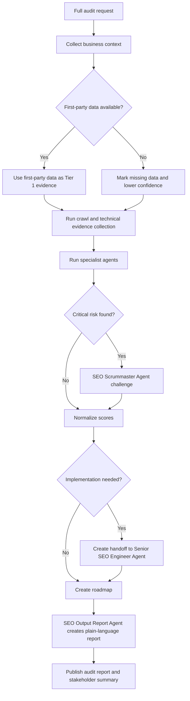

# Full Audit Workflow

1. Define target domain, business model, market, competitors, and goals.
2. Gather first-party data if available.
3. Crawl site and collect technical evidence.
4. Run SEO Technical Agent.
5. Run SEO Copywriter/Content Agent.
6. Run SEO Information Architecture Agent.
7. Run SEO Accessibility Agent.
8. Run SEO CRO Agent.
9. Run GEO / AIO Optimization Agent.
10. Run Local SEO Agent or International & Multilingual SEO Agent when applicable.
11. Run Negative SEO & Security Agent.
12. Run Competitive Intelligence Agent.
13. SEO Full Audit/Analyst Agent normalizes scores and writes the audit.
14. SEO Scrummaster Agent challenges high-impact findings.
15. Senior SEO Strategist Agent converts accepted findings into a roadmap.
16. SEO Output Report Agent creates a plain-language stakeholder report.

## Definition of Done

- Audit report complete
- Missing data disclosed
- Issues prioritized
- Owners assigned
- Risk levels assigned
- Verification methods defined
- Roadmap ready

## Decision Tree

## Failure Handling

- If crawl data is incomplete, scope findings to sampled URLs and request a complete crawl.
- If analytics are missing, separate technical findings from performance claims.
- If agents disagree, create a decision record before scoring.
