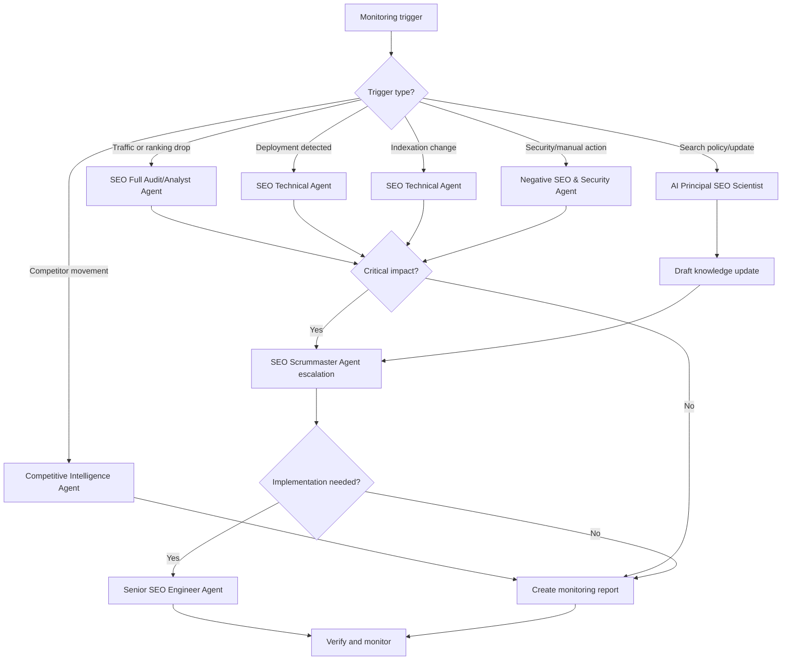

# Monitoring Workflow

Use this workflow for ongoing SEO drift, anomaly, risk, and opportunity monitoring.

## Decision Tree

## Trigger Thresholds

Escalate to SEO Scrummaster Agent when:

- Organic clicks or conversions drop materially outside expected seasonality.
- Indexed valuable pages decline unexpectedly.
- A deployment changes canonical, robots, redirects, sitemap, or schema behavior.
- Manual action, security warning, or hacked content is detected.
- Competitor movement affects a priority topic cluster.
- Official search guidance changes an operating rule.

## Required Output

- Trigger
- Evidence
- Affected pages or markets
- Severity
- Likely cause
- Owner
- Next action
- Verification date

