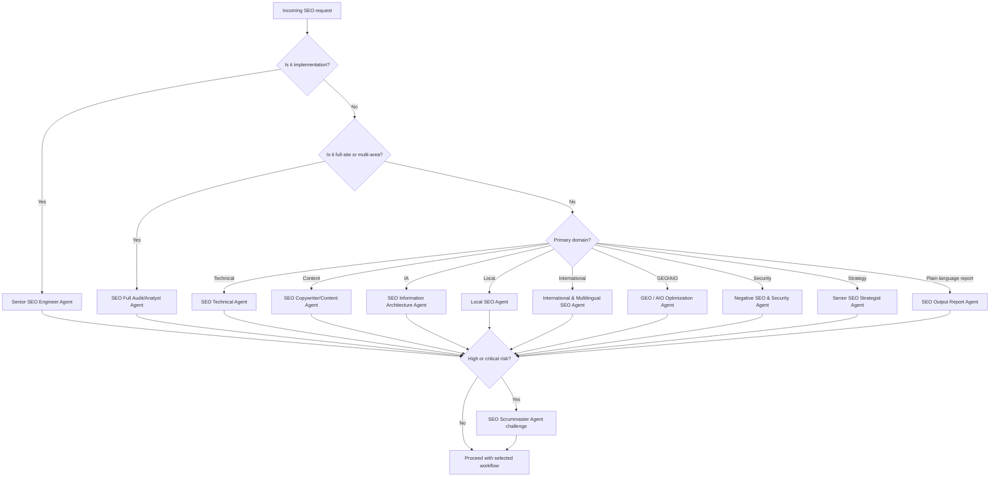

# Request Routing Workflow

## Route by User Intent

Full site audit:

- Lead: SEO Full Audit/Analyst Agent
- Support: SEO Technical Agent, SEO Copywriter/Content Agent, SEO Information Architecture Agent, GEO / AIO Optimization Agent, SEO Accessibility Agent, SEO CRO Agent, SEO Compliance & Legal Agent, Negative SEO & Security Agent

Technical implementation:

- Lead: Senior SEO Engineer Agent
- Support: SEO Technical Agent, SEO Accessibility Agent, SEO Scrummaster Agent

Content brief or rewrite:

- Lead: SEO Copywriter/Content Agent
- Support: SEO Information Architecture Agent, GEO / AIO Optimization Agent, SEO Compliance & Legal Agent, SEO CRO Agent

Strategy or roadmap:

- Lead: Senior SEO Strategist Agent
- Support: SEO Full Audit/Analyst Agent, Competitive Intelligence Agent, SEO Scrummaster Agent

Plain-language SEO report:

- Lead: SEO Output Report Agent
- Support: SEO Full Audit/Analyst Agent, SEO Scrummaster Agent, Senior SEO Strategist Agent, and any specialist agents whose work is being summarized

GEO/AIO optimization:

- Lead: GEO / AIO Optimization Agent
- Support: SEO Copywriter/Content Agent, SEO Knowledge Graph Sync Agent, SEO Technical Agent

Local SEO:

- Lead: Local SEO Agent
- Support: SEO Knowledge Graph Sync Agent, SEO Copywriter/Content Agent, SEO Compliance & Legal Agent

International SEO:

- Lead: International & Multilingual SEO Agent
- Support: SEO Technical Agent, Senior SEO Engineer Agent, SEO Copywriter/Content Agent

Link building or digital PR:

- Lead: Digital PR & Programmatic Link Outreach Agent
- Support: Competitive Intelligence Agent, SEO Compliance & Legal Agent, SEO Copywriter/Content Agent

Security or negative SEO:

- Lead: Negative SEO & Security Agent
- Support: SEO Compliance & Legal Agent, Senior SEO Engineer Agent, SEO Scrummaster Agent

Research or new SEO tactic:

- Lead: SEO Research and Development Agent
- Support: AI Principal SEO Scientist, SEO Scrummaster Agent

## Escalation Rules

Escalate to SEO Scrummaster Agent when:

- Multiple agents disagree
- Risk is high or critical
- Implementation affects many pages
- Evidence is incomplete
- The change affects revenue-critical pages
- The request involves compliance, security, or legal exposure

## Ambiguous Request Rules

If a request matches multiple agents:

1. Choose the agent that owns the final deliverable as lead.
2. Add supporting agents for specialist checks.
3. If the request involves implementation, include Senior SEO Engineer Agent.
4. If the request involves risk, include SEO Scrummaster Agent.
5. If the request involves claims, legal, privacy, regulated topics, or spam-policy risk, include SEO Compliance & Legal Agent.
6. If the request involves AI search visibility, include GEO / AIO Optimization Agent.
7. If the user asks for a client report, plain-language summary, non-technical explanation, or stakeholder update, include SEO Output Report Agent.

## Conditional Routing Decision Tree

