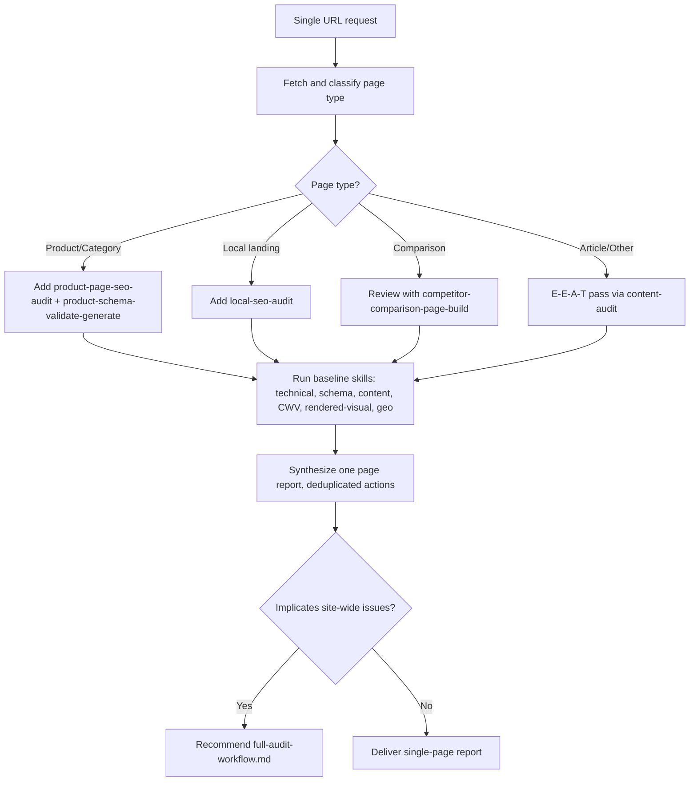

# Single-Page Audit Workflow

A cheap entry point that audits one URL by composing existing skills, without spinning up a full multi-agent site audit. Led by the SEO Full Audit/Analyst Agent using the `single-page-audit` skill.

## When to use

Use for "audit this page" or a single-URL request. For multi-page or site-wide scope, use `full-audit-workflow.md` instead. If the page implicates site-wide issues, recommend escalating to a full audit.

## Steps

1. Fetch and classify the page (homepage, article, product, category, local landing, comparison, other).
2. Select the relevant skills by page type. Baseline for any page: `technical-audit` (page-scoped), `schema-detect-validate-generate`, `content-audit`, `core-web-vitals-triage`, `rendered-visual-audit`, `geo-aio-citation-audit`.
3. Add type-specific skills: product to `product-page-seo-audit` and `product-schema-validate-generate`; local landing to `local-seo-audit`; comparison to `competitor-comparison-page-build` review; article to an E-E-A-T pass via `content-audit` with `knowledge/eeat-quality-rubric.md`.
4. Respect each skill's data tier and cost gates. Do not trigger metered calls without approval.
5. Synthesize one consolidated page report with a single prioritized action list and no duplicate findings.

## Routing

## Output

One single-page report: page type, normalized score, per-dimension summary, and one prioritized action list with evidence, confidence, impact, effort, risk, owner, acceptance criteria, and verification method. List any checks skipped and why.
