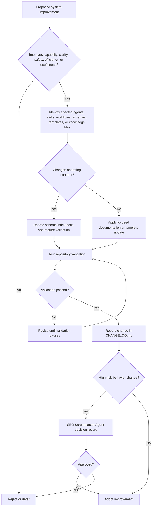

# System Improvement Loop

Use this workflow to improve the SEO agent system itself.

## Purpose

Continuously improve SEO capability, execution speed, evidence quality, safety, and agent synergy.

## Improvement Pass Checklist

For each pass, ask:

1. Does each agent have a clear mission?
2. Does each agent know when to act?
3. Does each agent know when not to act?
4. Are handoffs clear?
5. Are shared skills reused instead of duplicated?
6. Are quality gates strong enough?
7. Are risky actions gated?
8. Are outputs easy for engineers and SEO teams to use?
9. Are first-party data sources preferred?
10. Are official standards preferred over commentary?
11. Does the system avoid spam tactics?
12. Does the system protect accessibility?
13. Does the system protect compliance?
14. Does the system support GEO/AIO without abandoning core SEO?
15. Does the system improve operating efficiency?
16. Does the system avoid unnecessary agent activation?
17. Does the Scrummaster have enough authority?
18. Does the Strategist have enough business context?
19. Does the Engineer have safe implementation gates?
20. Does the Principal Scientist have a versioned rule path?
21. Does the whole system work better together after the change?

## Pass Output

Each improvement pass should produce:

- Improvement summary
- Files changed
- Capability improved
- Efficiency improved
- Risk reduced
- New validation needed

## Adoption Rule

Only keep improvements that make the system clearer, safer, more complete, more efficient, or more useful in real SEO engineering work.

## Decision Tree

