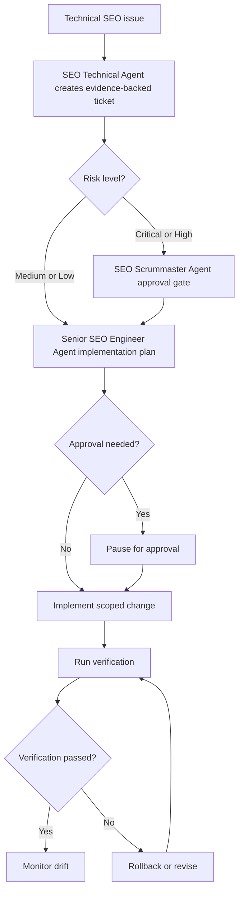

# Technical Deployment Workflow

1. SEO Technical Agent documents issue with evidence.
2. SEO Scrummaster Agent verifies priority and risk.
3. Senior SEO Engineer Agent designs smallest safe implementation.
4. SEO Accessibility Agent reviews UI-impacting changes.
5. SEO Compliance & Legal Agent reviews regulated or policy-sensitive changes.
6. Senior SEO Engineer Agent implements patch.
7. SEO Technical Agent validates output.
8. SEO Full Audit/Analyst Agent monitors drift after release.

## Required Verification

- Tests pass where applicable
- Rendered output checked
- Indexation/canonical/robots behavior checked if affected
- Structured data checked if affected
- Core Web Vitals checked if affected
- Rollback path documented

## Decision Tree

## Failure Handling

- If the app cannot run, produce a manual verification plan.
- If rendered output cannot be checked, do not claim implementation verified.
- If validation fails, rollback or keep change unmerged.
